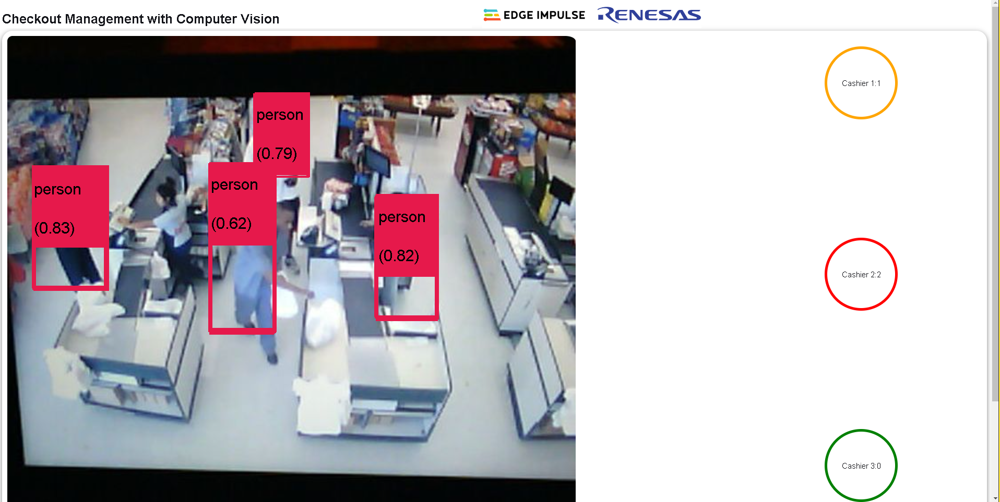
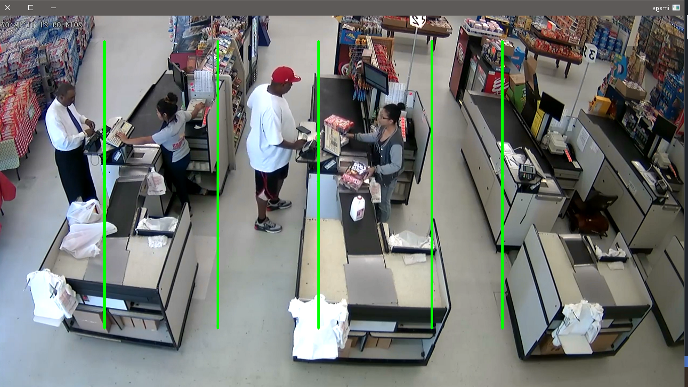

## Retail checkout line monitoring using Computer Vision, Edge Impulse and Renesas RZ/V2L



### Quick start

You can find the public Edge Impulse project here [Person Detection with Computer Vision](https://studio.edgeimpulse.com/public/140398/latest)

Ensure you have a recent version of Python then install the Edge-Impulse Linux Python SDK : 
``` bash
 pip3 install edge_impulse_linux -i https://pypi.python.org/simple
```

Next, install Flask which is required to run the application.
``` bash
pip3 install flask
```

Start the application by running the following command while in the root directory of this repo:
``` bash
python3 app.py
```

Alternatively, this Flask application has also been built as an executable for aarch64 (or amd64) platforms using Pyinstaller. This executable is in the dist folder. Run the commands below for the executable:
``` bash
cd dist && \ 
chmod +x app && \
./app
```
### Counting customers
For counting the number of people at each queue, we need to analyze the x values of the bounding boxes and check if they lie in the x values of where the checkout lines appear in an image.



For this demo, I will use the retail video [here](test_samples/Retail%20video%20credits%20Raul%2024-06%20GitHub.mp4). Using a reference image size of 1366x768 I calculated where the x values for each cashier's checkout lines seem to appear.

If you are projecting this demo video to a Dev board such as a Raspberry Pi with camera then ensure the source screen is aligned to properly so that the camera only sees the video, fully.

From left, we have cashier 1, then 2 in the middle and finally cashier 3 at the right. Based on the reference image resolution,  the regions of interest for each cashier's queue were found to be:

| Cashier Number | Queue region (x coordinates) |
| -------------- | ---------------------------- |
| 1              | from 0 to 101                |
| 2              | between 206 and 304          |
| 3              | between 398 and 468          |

Then from the Edge Impulse Python SDK we can check the x values of the found bounding boxes. 

The idea is that we need to know where our region of interest is with respect to the captured image size. Then from ``runner.classifier`` in [app.py](app.py) we can check where the bounding boxes are and increase the number of people at a queue based on it.


