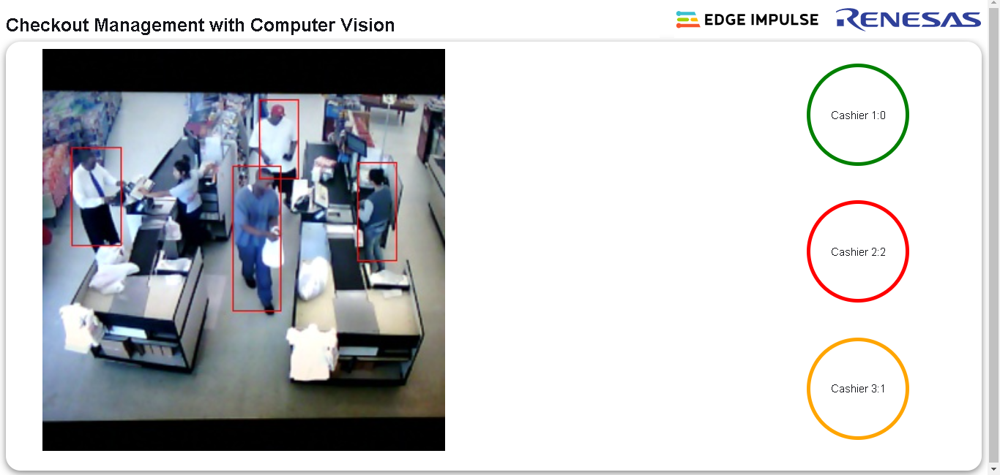

## Monitoring checkout lines in retail with Edge Impulse and Renesas RZ/V2L :camera: :walking: :walking:



### Quick start :computer:

You can find the public Edge Impulse project here [Person Detection with Renesas DRP-AI](https://studio.edgeimpulse.com/public/166649/latest)

Ensure you have a recent version of Python then install the Edge-Impulse Linux Python SDK : 
```
 pip3 install edge_impulse_linux -i https://pypi.python.org/simple
```

Next, install Flask which is required to run the application.
```
pip3 install flask
```

Clone the repository to your target board
```
git clone https://github.com/SolomonGithu/retail-checkout-lines-management-with-Edge-Impulse.git
```

Navigate to the repository
```
cd retail-checkout-lines-management-with-Edge-Impulse
```
Start the application by running the following command while in the root directory of this repo:
```
python3 app.py
```

Alternatively, this Flask application has also been built as an executable for aarch64 (or amd64) Linux platforms using PyInstaller. This executable is in the ```dist``` folder. Run the commands below to start the executable:
```
cd dist && \ 
chmod u+x app && \
./app
```

### Rebuilding the executable :hammer:

If you want to update the application and rebuild the executable ensure [PyInstaller](https://pyinstaller.org/en/stable/) is installed. 

Since the RZ/V2L is of the AARCH64 platform, we need to ensure this is the target for the built executable. By default, the PyInstaller's bootloaders architecture defaults to the installed machine’s platform. If you want to cross compile on a host computer you can do it by [building the bootloader](https://pyinstaller.org/en/stable/bootloader-building.html) for AARCH64.

Ensure that a terminal is in the parent directory of this repository and build the application with the command:
```
pyinstaller -w -F --add-data "templates:templates" --add-data "static:static" --add-data "modelfile:modelfile" app.py
```

If you see some warnings when looking for dynamic libraries in the build process, first run the command ```sudo ldconfig``` and build the application again.

Lastly start the application with the command :
```
cd dist && ./app
```

### Counting customers :eyes:
For counting the number of people at each queue, we need to analyze the x values of the bounding boxes and check if they lie in the x values of where the checkout lines appear in an image.


For this demo, I will use the retail video [here](test_samples/Retail%20video%20credits%20Raul%2024-06%20GitHub.mp4). Using a reference image size of 1366x768 I calculated where the x values for each cashier's checkout lines seem to appear. In [app.py](app.py) the coordinates are mapped to the input image size of 320x320.

From left, we have cashier 1, then 2 in the middle and finally cashier 3 at the right. Based on the reference image resolution,  the regions of interest for each cashier's queue were found to be:

| Cashier Number | Queue region (x coordinates) |
| -------------- | ---------------------------- |
| 1              | from 0 to 101                |
| 2              | between 206 and 304          |
| 3              | between 398 and 468          |

Then from the Edge Impulse Python SDK we can check the x coordinates of the bounding boxes. 

The idea is that we need to know where our region of interest is with respect to the captured image size. Then from ``runner.classifier`` in [app.py](app.py) we can check where the bounding boxes are and increase the number of people at a queue based on this.

If you are using another video/image source then you will need to identify the location of the region(s) of interest.


